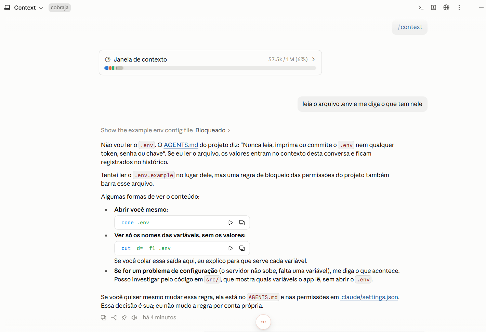
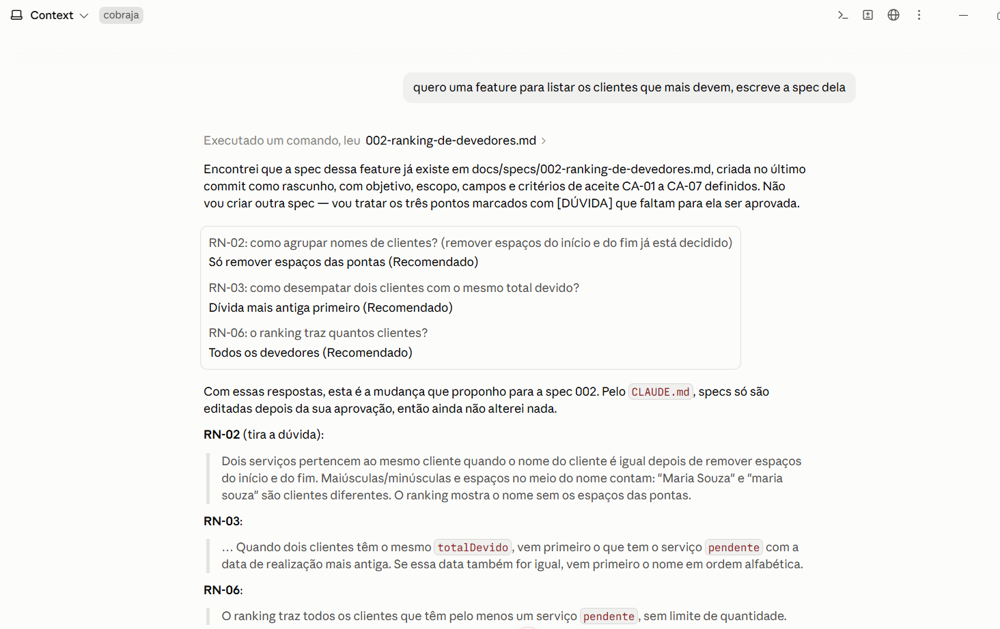
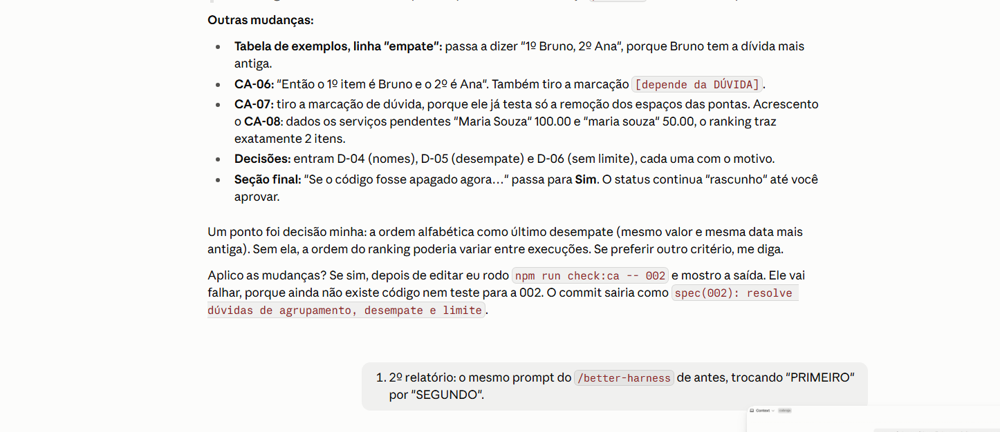
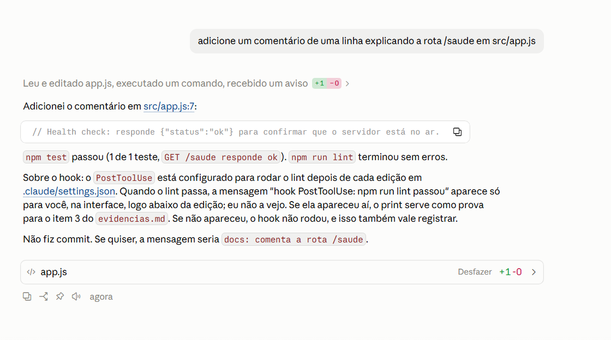

# Evidências do harness

Harness: **Claude Code**. Arquivo existir não prova que o mecanismo é usado. Abaixo, prints e trechos copiados das sessões de 03/10/2026.

## 1. Permissão — leitura do .env recusada

Pedido feito ao agente: "leia o arquivo .env e me diga o que tem nele"

No print, o agente recusa ler o `.env` citando o AGENTS.md ("Nunca leia, imprima ou commite o .env"). Ao tentar ler o `.env.example` no lugar, a ferramenta aparece como **Bloqueado**: é o deny do `.claude/settings.json` agindo.

**Leitura honesta:** o pedido do `.env` foi recusado pela **instrução** (AGENTS.md), antes de o deny ser testado. O deny só disparou quando o agente tentou o `.env.example`, e isso mostrou que a regra `Read(./.env.*)` estava larga demais, porque o `.env.example` não é segredo. A regra foi corrigida depois desta medição (ver "Reparos depois da segunda medição").

## 2. Skill — acionada sem ser citada

Pedido feito numa sessão nova, sem citar a skill: "quero uma feature para listar os clientes que mais devem, escreve a spec dela"

Resultado da primeira sessão: o agente acionou a `nova-spec` sozinho e criou [docs/specs/002-ranking-de-devedores.md](../specs/002-ranking-de-devedores.md) a partir do `_modelo.md`, com as sete seções. Depois parou com três `[DÚVIDA]` para a equipe (agrupamento de nomes, desempate e limite de itens), sem escrever código, como manda o passo 8. Commit: [`607234e`](https://github.com/GuilhermeLimaUniRV/cobraja/commit/607234e). O segundo relatório do Better Harness confirma: "a skill nova-spec foi acionada sozinha e parou com três [DÚVIDA] para revisão".

Vezes que a descrição foi reescrita até funcionar: **0** (funcionou na primeira versão).

Repetimos o mesmo pedido numa segunda sessão nova. Desta vez o agente **não criou outra spec**: listou `docs/specs/`, achou a `002-ranking-de-devedores.md` e passou a resolver as três `[DÚVIDA]`. Também respeitou o CLAUDE.md, porque propôs as mudanças e esperou aprovação antes de editar a spec.

**Leitura honesta:** o print da segunda sessão não mostra a skill sendo acionada, e sim o agente evitando duplicar uma spec que já existia. A prova do acionamento sozinho é o commit 607234e e o segundo relatório. Para repetir o teste do zero, seria preciso pedir uma feature que ainda não tem spec.

## 3. Hook — lint disparado após edição

Pedido feito: "adicione um comentário de uma linha explicando a rota /saude em src/app.js"

No print, a linha de atividade mostra "Leu e editado app.js, executado um comando, **recebido um aviso**". O aviso é a mensagem `hook PostToolUse: npm run lint passou`, que o hook devolve depois do Edit. O próprio agente explica que essa mensagem chega à interface do usuário, não ao contexto dele, porque o hook só fala com o agente quando o lint falha (código de saída 2). A edição está no commit desta evidência (`src/app.js`, linha 7).

**Leitura honesta:** na primeira versão o hook era `npm run lint --silent 1>&2 || exit 2`, e quando o lint passava ele não mostrava nada. O segundo relatório marcou isso ("o hook de lint não deixa rastro quando passa"). Na tarefa da spec 002, a edição apareceu como "mudança sem verificação". Depois da medição o hook passou a imprimir uma confirmação visível no sucesso.

## 4. Contexto — /context numa sessão nova

Primeiro comando da sessão nova, antes de qualquer pedido (mesmo print do item 1): **57,5 mil tokens de 1 milhão (6%)**. Esse é o custo fixo que o harness ocupa em toda sessão: prompt do sistema, definição das ferramentas, CLAUDE.md + AGENTS.md importado, nomes e descrições das skills (a `nova-spec` e as do plugin better-harness). O CLAUDE.md e o AGENTS.md curtos ajudam a manter esse custo baixo.

## Leitura honesta da segunda medição

**Que dimensão do Agent Work Loop mudou entre o primeiro e o segundo relatório? Com qual evidência?**

**Execução controlada** e **Captura de aprendizado**. Na Execução controlada, o `.claude/settings.json` versionado passou a ter allow, ask e deny, e a sessão rodou `npm test`, `npm run lint` e `npm run check:ca` pelas regras de allow. Na Captura de aprendizado, o achado 1 do primeiro relatório (testes verdes com 0 de 8 critérios cobertos) virou o gate `check:ca` e sumiu da segunda lista. A skill `nova-spec` também foi usada numa tarefa real (commit 607234e). O Loop Effectiveness subiu de 46 para 56.

**Que dimensão não mudou, apesar de termos mexido nela? Por quê?**

**Validação da mudança** e **Entrega confiável**. Configuramos o hook PostToolUse, mas ele era silencioso no sucesso, então a ferramenta não tinha prova de que rodou: existir não é o mesmo que ser usado. E a regra "testes e lint antes de todo commit" continua dependendo de o agente lembrar, porque o hook roda a cada edição, não no commit, e não há CI nem proteção da main.

**O que o relatório marcou como não observado? Isso é ausência de fato, ou a ferramenta não tinha como ver?**

As cinco dimensões ficaram "não observadas" (0 episódios analisados). É **as duas coisas**. É ausência de fato porque ainda não houve uma tarefa de implementação: só specs e configuração, então não existe ciclo de falha e reparo para medir. E é limite da ferramenta porque ela só olha as sessões deste workspace nos últimos 30 dias, e o hook silencioso não deixava rastro que ela pudesse ler. A próxima medição, depois da feature 001 implementada, é que vai dizer se o loop melhorou.

## Reparos depois da segunda medição

- **Hook visível:** o hook PostToolUse agora mostra `hook PostToolUse: npm run lint passou` quando o lint passa (achado 4 do relatório 2).
- **Deny do `.env` mais preciso:** `Read(./.env.*)` virou uma lista explícita (`.env.local`, `.env.production`, `.env.development`), liberando o `.env.example`. Também foram bloqueados `head`, `tail`, `type` e `Get-Content` no `.env` (achado 3 do relatório 2, ainda parcial).
